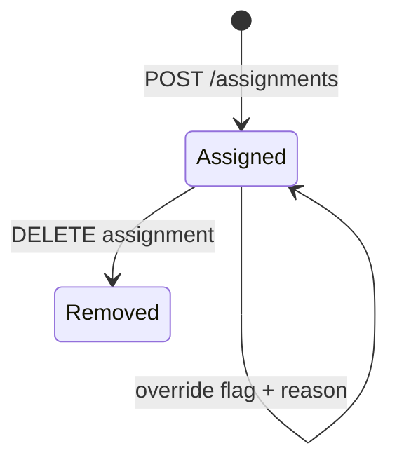

# Assignment lifecycle

## Actors

- Choir leader / protocol leader (assign, bulk assign, override)
- Member (view assignment, request swap/replacement)
- System (conflict detection, audit)

## States

| State | Description |
|-------|-------------|
| Active assignment | `EventAssignment` linked to `SCHEDULED` event |
| Override | `isOverride=true` with `overrideReason` and audit |

## Transitions

## Notifications

- Member notified on new assignment (`EVENT_ASSIGNED`)

## Audit log actions

- `ASSIGNMENT_CREATE`, `ASSIGNMENT_OVERRIDE`, bulk operations logged per member

## Offline behavior

- Bulk assign requires online; validate preview via `POST /assignments/validate`
- `EventAssignment` entity supported in sync batch

## Conflict rules

- Schedule overlap (`SCHEDULE_OVERLAP`)
- Ministry mismatch (`MINISTRY_CONFLICT`)
- Protocol quota: 12 members/service, 3 services/month
- Choir rotation rules unless override with audit

## Localization considerations

- Conflict codes returned with `messageKey` for client catalog
- UI: `assignment_conflict_warning`, `assignment_validate_action`
