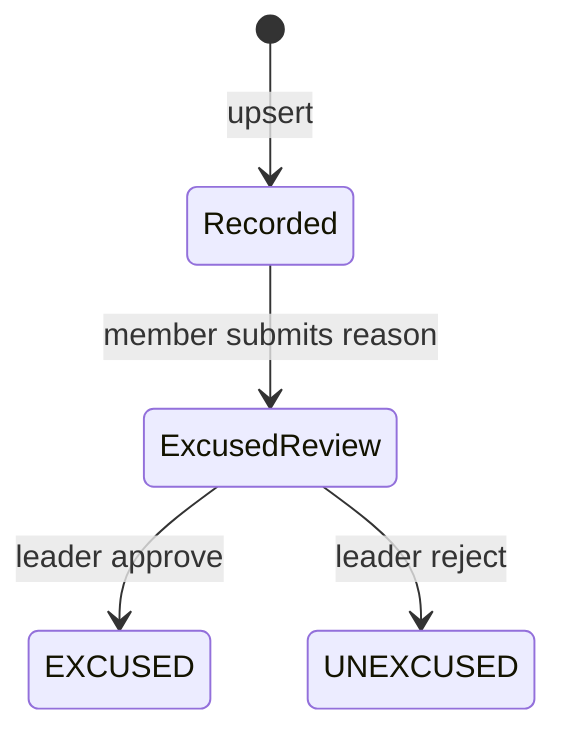

# Attendance lifecycle

## Actors

- Member (self mark, excused reason request)
- Leader (mark, bulk mark, approve/reject excused)
- System (scores, sync, audit)

## States

| Physical | Reason | Meaning |
|----------|--------|---------|
| `PRESENT` | — | Attended |
| `LATE` | — | Late |
| `ABSENT` | `EXCUSED` / `UNEXCUSED` | Absence classification |
| Locked | — | After lock window (cron) |

## Transitions

## Notifications

- Leader alert on excused absence pending review
- Member notified on approve/reject

## Audit log actions

- `ATTENDANCE_UPSERT`, `ATTENDANCE_EXCUSED_APPROVED`, `ATTENDANCE_EXCUSED_REJECTED`

## Offline behavior

- Single and bulk attendance enqueue to `sync_queue` as `Attendance`
- Bulk: `POST /attendance/bulk` when online

## Conflict rules

- One attendance row per member per event (upsert)
- Edits after lock rejected by business rules

## Localization considerations

- Status chips use `attendancePhysicalStatusLabel` / `attendanceReasonCategoryLabel`
- Bulk screen titles: `attendance_bulk_*`
