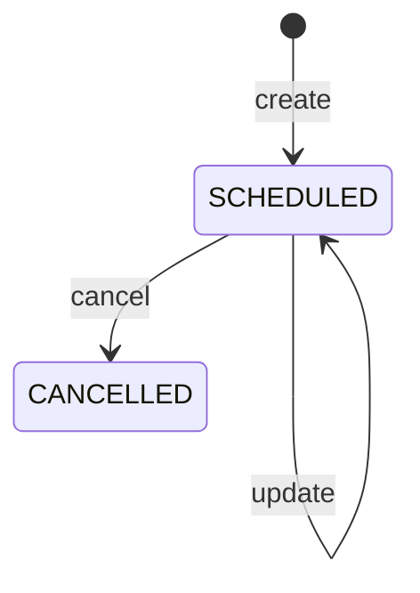

# Event lifecycle

## Actors

- Church admin / choir leader / protocol leader (create, edit, cancel)
- Assigned members (view, receive notifications)
- System (audit, sync, conflict checks on assignments)

## States

| State | Description |
|-------|-------------|
| `SCHEDULED` | Active event on calendar |
| `CANCELLED` | Cancelled; assignments retained for history |

## Transitions

## Notifications

- `EVENT_ASSIGNED` when members are assigned to a scheduled event
- Leader broadcast optional via notifications service after create/update

## Audit log actions

- `EVENT_CREATE`, `EVENT_UPDATE`, `EVENT_CANCEL`

## Offline behavior

- Event list cached in Hive (`events_list`, `event_{id}`)
- Creates/updates require online unless queued as `Event` sync entity (batch sync)
- Calendar reads cache when API unavailable

## Conflict rules

- Assignment overlap validated at assign time (not at bare event create)
- Children choir: Service 1 only (choir rules in conflict engine)
- Protocol: max 12 per service, 3 services/month per member

## Localization considerations

- Event types and ministry scopes use semantic ARB keys (`event_type_*`, `term_*`)
- Dates via `LocaleDateFormat` (rw/en/fr)
- API errors mapped through `ApiErrorLocalizer`
