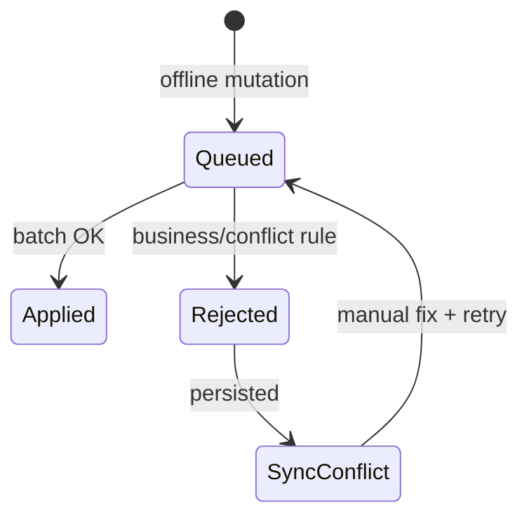

# Sync conflict lifecycle

## Actors

- Mobile client (enqueue, batch sync, retry)
- Sync service (apply/reject, record conflict)
- Leader/user (review conflicts UI)

## States

| Queue item | Server result |
|------------|---------------|
| Pending in Hive | — |
| Applied | Removed from queue |
| Rejected | Stays or removed; `SyncConflict` row created |

## Transitions

## Notifications

- Optional alert when `syncConflicts` count > 0 on leader dashboard

## Audit log actions

- Sync apply/reject logged per entity in sync service

## Offline behavior

- All supported entities listed in `syncEntities` constant
- `GET /sync/conflicts` lists server-side conflicts with `reason`
- Last sync timestamp stored in Hive `cache.last_sync_at`

## Conflict rules

- Server wins on version/lock violations
- Rejection `reason` shown in sync UI (`sync_conflict_reason`)

## Localization considerations

- Sync messages: `sync_*` ARB keys
- Rejection reasons may be server-localized via `Accept-Language`
