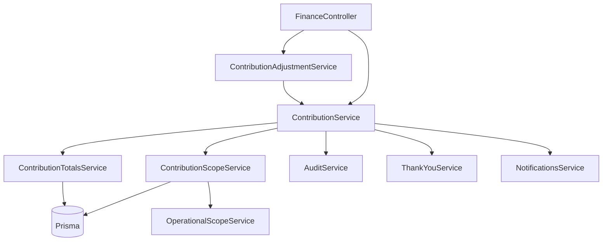

# Sprint 10.2 — Contribution Engine Implementation Specification

**Version:** 1.3 (reporting & personal visibility — see [SPRINT_10_v1.3.md](./SPRINT_10_v1.3.md))  
**Status:** **COMPLETE** — backend sign-off (Sprint 10.3 Web UI next)  
**Parent spec:** [SPRINT_10.md](./SPRINT_10.md) (v1.2 foundation lock)  
**Prerequisite:** Sprint 10.1 schema & RBAC ✅  
**Frozen API contract:** [API_CONTRACT_CONTRIBUTIONS_v1.md](./API_CONTRACT_CONTRIBUTIONS_v1.md)

---

## Architecture freeze

**Sprint 10.1:** ✅ Complete (schema, family model, catalog, campaigns, RBAC, admin separation, leadership history foundation).

**Sprint 10.2 specification:** ✅ Locked (v1.2) — data ownership, scope service, adjustment categories, immutable amounts, approval authority, hidden features, E2E Suites 0–10, sign-off checklist.

**Sprint 10.2 implementation:** ✅ **COMPLETE** — sub-sprints **10.2.0–10.2.8** verified via `npm run test:e2e -- --testPathPatterns="sprint-10"`.

| Sub-sprint | Status |
|------------|--------|
| 10.2.0 Data ownership | ✅ |
| 10.2.1 Member submission | ✅ |
| 10.2.2 Family inbox | ✅ |
| 10.2.3 Approval / reject | ✅ |
| 10.2.4 Ledger posting | ✅ |
| 10.2.5 Goals, lists, rankings | ✅ |
| 10.2.6 Thank-you | ✅ |
| 10.2.7 Governance corrections | ✅ |
| 10.2.8 Leadership governance | ✅ |

Additional design work at this stage has **diminishing returns**. The next milestone is **Sprint 10.3** (Web UI) against the frozen API contract.

---

## Readiness Assessment

| Area | Status |
|------|--------|
| Membership model | ✅ Locked |
| Family model | ✅ Locked |
| Contribution governance | ✅ Locked |
| Approval flow | ✅ Locked |
| Campaigns | ✅ Locked |
| Adjustment system | ✅ Locked |
| Audit strategy | ✅ Locked |
| RBAC | ✅ Locked |
| Visibility rules | ✅ Locked |
| API design | ✅ Locked |
| Data ownership (10.2.0) | ✅ Locked |
| E2E strategy | ✅ Locked |
| Implementation | ✅ Complete |

**Overall readiness: 10/10.**

---

## Purpose

Sprint 10.2 turns the Sprint 10.1 schema into a **working choir contribution system** on the backend: member submission, family approval, ledger posting, effective-amount totals, thank-you notifications, leadership adjustments, and leadership history completion.

**In scope (10.2):** NestJS services, controllers, DTOs, permission/scope resolution, domain events, audit actions, notification hooks, unit tests, E2E exit suite.

**Out of scope (later sprints):**

| Sprint | Deferred work |
|--------|----------------|
| 10.3 | Web submission / approval UI |
| 10.4 | Mobile UI |
| 10.5 | Dashboard widgets, rankings UI, analytics screens |
| 10.6 | Receipt upload/storage (10.2 accepts optional `receiptUrl` string only) |

---

## Gap Analysis (Current → Target)

| Area | Current (`contribution.service.ts`) | Target (10.2) |
|------|-------------------------------------|---------------|
| Submit flow | `PENDING` → separate `submit` call | Single call → `SUBMITTED` with `claimedAmount` |
| Amount fields | Legacy `amount` only | `claimedAmount` + mirror `amount` for compat |
| Type | Enum `ContributionType` | `ContributionTypeCatalog` (+ legacy enum mirror) |
| Campaign | Not used | Optional; only `ACTIVE` campaigns |
| Family link | Optional DTO `familyId` | Auto from `FamilyMember` snapshot |
| Approval actor | Treasurer via `FINANCE_MANAGE` + `confirmContribution` | Family Head / delegated Assistant |
| Confirmed amount | Uses `record.amount` | `confirmedAmount`; ledger = `confirmedAmount` |
| Discrepancy | None | `discrepancyReason` required when amounts differ |
| Reject | `notes` optional | `rejectionReason` required |
| Approval inbox | Ministry-wide `SUBMITTED` queue | Family-scoped queue only |
| Adjustments | None | `ContributionAdjustment` + audit |
| Effective amount | Not computed | `confirmedAmount + Σ(adjustmentAmount)` |
| Totals / goals | `amount` on CONFIRMED | `effectiveAmount` for official metrics |
| Thank-you | On treasurer confirm | On family `CONFIRMED` only |
| Leadership history | Head on create/update/add/remove | + role change on `updateMember` / `delegationEnabled` audit |
| Permissions | `FINANCE_MANAGE` on confirm | Operational family facts + contribution permission codes |

**Do not create** a parallel contribution module or duplicate entities. Extend `FinanceModule` / `ContributionService` (split helpers where clarity demands).

---

## Sprint 10.2.0 — Data Ownership Audit (implementation gate)

**Runs before Steps 1–8.** No feature work ships until every contribution-related endpoint passes this gate.

### Objective

Verify that each API enforces the **data ownership model**: callers only receive or mutate data their role is allowed to see, and forbidden capabilities return **403** (authenticated misuse) or **404** (feature hidden per v1.2).

Implement ownership in **`ContributionScopeService`** + **`ContributionSerializer`**; controllers must not embed ad-hoc checks.

### Role ownership matrix

| Role | Can access | Can do | Cannot |
|------|------------|--------|--------|
| **Member** | Own contribution records, own history, own receipts | Submit own | Other members’ records; family totals; rankings; goals; approval inbox |
| **Secretary** | Family contribution records, family activity, family history | View family scope | Approve; reject; adjust; manage goals; manage campaigns |
| **Assistant Head** | Family records, family queue | Approve/reject **only if** `family.delegationEnabled = true` | Approve when delegation off; adjust (unless also holds adjust permission); manage goals/campaigns |
| **Head** | Family records, family queue, family dashboard (family scope) | Approve; reject; adjust **family-scoped** records only | Other families; choir-wide rankings; approve outside own family |
| **Family Coordinator** | All families, all family dashboards, rankings, goals | Adjust (all); manage types/campaigns per permissions | Approve family submissions **unless** also assigned as Head/Assistant in that family |
| **President / Vice President** | All contribution intelligence, rankings, goals, campaigns | Adjust (all) | Approve/reject **unless** also family Head/Assistant |
| **Treasurer** | Everything contribution-related (view/audit/export) | Adjust; audit; export; investigate | Approve; reject (family gate is Head/Assistant only) |
| **CHURCH_ADMIN** (account only) | — | — | All contribution/family/finance ministry routes (unless union ministry role) |

**Approval is exclusive to family operational leaders** (Head + delegated Assistant). Executives and Treasurer **never** substitute for family approval, even with `choir.contribution.view.all`.

### Endpoint ownership checklist

Audit **existing and new** routes. Each row must name the enforcing method (e.g. `assertOwnMember`, `assertFamilyView`, `assertFamilyApprove`, `assertAdjustScope`, `assertViewAll`).

| Endpoint | Member | Secretary | Asst (deleg off/on) | Head | Coordinator | Pres/VP | Treasurer | CHURCH_ADMIN |
|----------|--------|-----------|---------------------|------|-------------|---------|-------------|--------------|
| `POST /finance/contributions/submit` | ✅ own | ❌ | ❌ | ❌ | ❌ | ❌ | ❌ | ❌ |
| `GET /finance/contributions/mine` | ✅ own | ❌ | ❌ | ❌ | ❌ | ❌ | ❌ | ❌ |
| `GET /finance/my-contributions` | ✅ own | ❌ | ❌ | ❌ | ❌ | ❌ | ❌ | ❌ |
| `GET /finance/my-contributions/summary` | ✅ own | ❌ | ❌ | ❌ | ❌ | ❌ | ❌ | ❌ |
| `GET /finance/contributions/mine/export/*` | ✅ own | ❌ | ❌ | ❌ | ❌ | ❌ | ✅* | ❌ |
| `GET /finance/contributions/family/inbox` | ❌ | ✅ view | ✅ view | ✅ | ✅ all families | ✅ | ✅ | ❌ |
| `GET /finance/contributions/family` | ❌ | ✅ | ✅ | ✅ | ✅ | ✅ | ✅ | ❌ |
| `POST /finance/contributions/:id/family/approve` | ❌ | ❌ | ❌ / ✅ | ✅ | ❌† | ❌† | ❌ | ❌ |
| `POST /finance/contributions/:id/family/reject` | ❌ | ❌ | ❌ / ✅ | ✅ | ❌† | ❌† | ❌ | ❌ |
| `POST /finance/contributions/:id/adjust` | ❌ | ❌ | ❌ | ✅ family | ✅ all | ✅ all | ✅ all | ❌ |
| `GET /finance/contributions/totals` | ❌ own only‡ | ❌ family | ❌ family | ✅ family | ✅ all | ✅ all | ✅ all | ❌ |
| `GET /finance/contributions` (list all) | ❌ | ❌ | ❌ | ❌ | ✅ | ✅ | ✅ | ❌ |
| `GET /finance/stewardship/analytics` | ❌ | ❌ | ❌ | ❌ | ✅ | ✅ | ✅ | ❌ |
| `GET /finance/contributions/queue` (legacy) | ❌ | — | — | — | **410** | **410** | **410** | ❌ |
| `POST /finance/contributions/:id/confirm` (legacy) | ❌ | — | — | — | **410** | **410** | **410** | ❌ |
| `POST /finance/contributions/:id/resend-thank-you` | ❌ | ❌ | ❌ | ✅ family | ✅ | ✅ | ✅ | ❌ |
| Search `type=contribution` | ❌ | ❌ | ❌ | ❌ | ✅ | ✅ | ✅ | ❌ |
| Dashboard contribution widgets | own progress only | ❌ rankings | ❌ rankings | family | all | all | all | ❌ |

\*Treasurer export only via ministry export routes with finance permissions, not member “mine” routes.  
†Unless also `FamilyMember` Head/Assistant in that family.  
‡Member may call totals endpoint scoped implicitly to **self** (my progress), not family/choir aggregates — prefer folding into `/mine` to avoid a separate totals leak.

### 10.2.0 deliverables

1. **Schema:** add `ContributionAdjustmentCategory` enum and required `category` on `ContributionAdjustment` (see Step 7).
2. **`ContributionScopeService`:** single source for all matrix rows above.
3. **`docs/pilot/SPRINT_10_2_OWNERSHIP.md`** (optional one-pager) OR maintain matrix in this section — must stay in sync with E2E Suite 0.
4. **E2E Suite 0 — Data ownership** (runs before Suite 1): one test per forbidden cell for representative endpoints.
5. **Sign-off:** Tech lead ticks every row in the checklist table before merging Step 1.

---

## Architecture

### Module layout

```
backend/src/finance/
├── contribution.service.ts          # Orchestrator (refactor)
├── contribution-scope.service.ts  # NEW — family role + delegation
├── contribution-totals.service.ts   # NEW — effectiveAmount aggregates
├── contribution-adjustment.service.ts # NEW — step 7
├── contribution-effective.util.ts   # NEW — pure effectiveAmount math
├── contribution.serializer.ts     # NEW — API shapes + visibility stripping
├── dto/
│   ├── submit-contribution.dto.ts   # NEW — member submit (step 1)
│   ├── approve-contribution.dto.ts  # NEW — step 3
│   ├── reject-contribution.dto.ts   # UPDATE — rejectionReason required
│   └── adjust-contribution.dto.ts   # NEW — step 7
├── events/
│   ├── contribution-submitted.event.ts   # NEW
│   ├── contribution-confirmed.event.ts   # UPDATE — confirmedAmount, catalog
│   ├── contribution-rejected.event.ts    # NEW
│   └── contribution-adjusted.event.ts    # NEW
└── finance.controller.ts          # Route changes (see API section)
```

### Dependency flow



### Core utilities

**`computeEffectiveAmount(record)`** — pure function:

```typescript
effectiveAmount =
  Number(confirmedAmount ?? 0) +
  adjustments.reduce((sum, a) => sum + Number(a.adjustmentAmount), 0);
```

Only `CONFIRMED` records participate in official totals. `SUBMITTED` uses `claimedAmount` for pending metrics.

**`ContributionScopeService`** — resolves per request:

| Fact | Source |
|------|--------|
| Actor `memberId` | `OperationalScopeService` / `PermissionsResolver` |
| Family memberships | `FamilyMember` where `memberId = actor` |
| Can approve family | `HEAD` always; `ASSISTANT_HEAD` iff `family.delegationEnabled` |
| Can view family queue | `HEAD`, `ASSISTANT_HEAD`, `SECRETARY` |
| Can adjust | `choir.contribution.adjust` (all scope) **OR** family `HEAD` (family-scoped only). President, VP, Treasurer, Coordinator use adjust permission, **not** approve. |
| Can view all | `choir.contribution.view.all` |
| Can submit | `choir.contribution.submit` + active choir member |

Family operational facts **do not require** seeding `choir.contribution.approve.family` on the Head user role; the guard checks `FamilyMember.role` at runtime. The permission code remains for documentation, future policy engines, and optional explicit grants.

---

## Permission & Guard Matrix

### Permission codes (already in `roles.ts`)

| Code | Purpose |
|------|---------|
| `choir.contribution.submit` | Member self-submit |
| `choir.contribution.approve.family` | Documented; optional explicit grant |
| `choir.contribution.view.family` | Documented; family leadership view |
| `choir.contribution.view.all` | Executive / coordinator view all families |
| `choir.contribution.adjust` | Post-approval corrections |
| `choir.contribution.type.manage` | Catalog CRUD (soft lifecycle) — optional in 10.2 |
| `choir.contribution.campaign.manage` | Campaign CRUD — optional in 10.2 |

### Endpoint guards

| Endpoint | JWT | Permission / operational gate |
|----------|-----|------------------------------|
| `POST /finance/contributions/submit` | ✅ | `choir.contribution.submit` + phone guard |
| `GET /finance/contributions/mine` | ✅ | `choir.contribution.submit` (own only) |
| `GET /finance/contributions/family/inbox` | ✅ | Family HEAD / ASSISTANT_HEAD / SECRETARY |
| `POST .../family/approve` | ✅ | HEAD or (ASSISTANT_HEAD + `delegationEnabled`) |
| `POST .../family/reject` | ✅ | Same as approve |
| `GET /finance/contributions/family` | ✅ | Family leadership view scope |
| `GET /finance/contributions` (all) | ✅ | `choir.contribution.view.all` |
| `POST .../adjust` | ✅ | Adjust permission + scope rules |
| `GET .../totals` | ✅ | View scope (family or all); **404 if no permission** |
| Legacy `POST .../confirm` | ✅ | **Remove or 410** — replaced by family approve |

### Hidden features (10.2 backend)

| Caller | Must receive |
|--------|----------------|
| Member without leadership | Own records only; no inbox, totals, rankings |
| Secretary | Family view + inbox read-only; approve/reject **403** |
| Assistant, delegation off | Inbox visible; approve/reject **403** |
| CHURCH_ADMIN (account only) | **403** on all contribution routes |
| No `view.all` | No cross-family list, no choir-wide totals |

Return **404** (not 403) for ranking/intelligence endpoints when the spec calls for “feature does not exist” — use 403 only for authenticated users attempting forbidden actions on known resources.

---

## REST API Specification

Base path: `/api/v1/finance`. All responses pass through `ResponseInterceptor` (`{ data, meta }`).

### Step 1 — Member submission

**`POST /finance/contributions/submit`**

Replaces separate `create` + `submit` for the choir member flow. Legacy routes may remain deprecated one sprint.

**Guard:** `choir.contribution.submit`, `PhoneOperationalGuard`

**Body (`SubmitContributionDto`):**

| Field | Type | Required | Rules |
|-------|------|----------|-------|
| `contributionTypeCatalogId` | UUID | ✅ | Catalog `active = true`, `ministryScope = CHOIR` |
| `contributionCampaignId` | UUID | ❌ | Campaign `status = ACTIVE`, matches catalog type |
| `claimedAmount` | number | ✅ | `> 0` |
| `paymentAt` | ISO datetime | ✅ | Single payment timestamp |
| `paymentChannel` | `MOMO \| BANK \| OTHER` | ✅ | |
| `currency` | string | ❌ | Default `RWF` |
| `receiptUrl` | string | ❌ | Optional; never blocks approval |
| `notes` | string | ❌ | Max 500 |

**Server actions:**

1. Resolve actor `memberId` from JWT.
2. Load active `FamilyMember` → set `familyId` snapshot (fail **400** if no family).
3. Validate catalog + campaign.
4. Generate `referenceNumber` (`CNT-YYYYMMDD-XXXXXX`).
5. Create record:
   - `status = SUBMITTED`
   - `claimedAmount`, `amount = claimedAmount` (compat)
   - `memberId`, `familyId`, `paymentAt`, `paymentChannel`
   - Mirror legacy `contributionType` enum from catalog code map (transition)
6. Audit: `CONTRIBUTION_SUBMIT`
7. Notify member: submitted message
8. Notify family HEAD (+ delegated ASSISTANT if enabled): new submission
9. Emit `ContributionSubmittedEvent`

**Response `201`:** serialized contribution (see Response shape).

**Errors:**

| Status | When |
|--------|------|
| 400 | No family, inactive type, invalid campaign, validation |
| 403 | Missing submit permission |
| 404 | Unknown catalog/campaign ids |

---

### Step 2 — Family approval inbox

**`GET /finance/contributions/family/inbox`**

**Guard:** actor has family role `HEAD`, `ASSISTANT_HEAD`, or `SECRETARY` in at least one family.

**Query:**

| Param | Default | Description |
|-------|---------|-------------|
| `familyId` | — | Required if actor in multiple families |
| `status` | `SUBMITTED` | Filter |
| `limit` | 30 | Max 100 |

**Logic:** `WHERE familyId = :familyId AND status = SUBMITTED ORDER BY createdAt ASC`

Secretary receives list; approve/reject endpoints still deny secretary.

**Response `200`:** `{ items: ContributionSummary[], familyId, pendingCount }`

---

### Step 3 — Approval logic

**`POST /finance/contributions/:id/family/approve`**

**Body (`ApproveContributionDto`):**

| Field | Required | Rules |
|-------|----------|-------|
| `confirmedAmount` | ✅ | `> 0` |
| `discrepancyReason` | Conditional | Required if `confirmedAmount !== claimedAmount` |

**Guard:** `ContributionScopeService.assertCanApprove(record.familyId)`

**Transaction:**

1. Assert `status === SUBMITTED`.
2. Set `confirmedAmount`, `discrepancyAmount = claimed - confirmed`, `discrepancyReason`.
3. **Do not mutate** `claimedAmount`.
4. `status = CONFIRMED`, `familyApprovedAt`, `familyApprovedByMemberId`.
5. Create `FinanceTransaction` with `amount = confirmedAmount`.
6. Link `financeTransactionId`, `confirmedAt`, `confirmedById` (user id).
7. Audit: `CONTRIBUTION_FAMILY_APPROVE`
8. Emit `ContributionConfirmedEvent` → thank-you + member notification
9. Refresh totals cache via `ContributionTotalsService` (step 5)

**`POST /finance/contributions/:id/family/reject`**

**Body (`RejectContributionDto`):**

| Field | Required |
|-------|----------|
| `rejectionReason` | ✅ non-empty |

Sets `status = REJECTED`, `familyRejectedAt`, `familyRejectedByMemberId`, `rejectionReason`. Audit: `CONTRIBUTION_FAMILY_REJECT`. Notify member.

---

### Step 4 — Ledger posting

Implemented inside approve transaction (above).

| Field | Value |
|-------|-------|
| `FinanceTransaction.amount` | `confirmedAmount` |
| `FinanceTransaction.type` | `INCOME` |
| `FinanceTransaction.category` | Mapped from catalog code |
| `FinanceTransaction.memberId` | Submitter |
| `FinanceTransaction.transactionDate` | `paymentAt` or `now()` |

**Never** post `claimedAmount`. Adjustments do **not** rewrite ledger rows in 10.2 (append-only adjustments affect `effectiveAmount` only; optional future `CONTRIBUTION_ADJUST_LEDGER` sprint).

---

### Step 5 — Goals & lists (backend aggregates)

**`GET /finance/contributions/totals`**

**Guard:** `view.family` operational fact OR `choir.contribution.view.all`

**Query:** `familyId?`, `contributionTypeCatalogId?`, `contributionCampaignId?`, `from?`, `to?`

**Response:**

```typescript
{
  pending: { count, claimedTotal },      // SUBMITTED — claimedAmount
  confirmed: { count, effectiveTotal }, // CONFIRMED — effectiveAmount
  byType: [{ catalogId, code, pendingClaimed, confirmedEffective }],
  byCampaign: [{ campaignId, goalAmount, confirmedEffective, progressPct }],
  byFamily?: [{ familyId, confirmedEffective }]  // only with view.all
}
```

**Rules:**

- Official totals sum `effectiveAmount` per confirmed record.
- Pending sums `claimedAmount` for `SUBMITTED`.
- Campaign progress: only `ACTIVE` + `COMPLETED` campaigns in operational views; `ARCHIVED` only when `?includeArchived=true` + leadership scope.

Implement aggregation in `ContributionTotalsService` with Prisma raw/SQL or in-memory after loading adjustments — prefer DB aggregation for performance.

---

### Step 6 — Thank-you & notifications

**Trigger:** `ContributionConfirmedEvent` only.

**`ThankYouService` updates:**

- Use `confirmedAmount` (not legacy `amount`).
- Require member `phone` non-empty; skip with audit note if missing (do not fail approval).
- Message (i18n keys to add in `backend/src/i18n/messages/{en,fr,rw}.ts`):

| Key | Audience | Text (EN concept) |
|-----|----------|-------------------|
| `contribution.submitted.member` | Submitter | Contribution submitted. Awaiting family confirmation. |
| `contribution.submitted.head` | Head/Asst | New contribution awaiting review. |
| `contribution.confirmed.member` | Submitter | Contribution confirmed. Confirmed amount: {amount} |
| `contribution.rejected.member` | Submitter | Contribution rejected. Reason: {reason} |

**No notifications** to: Secretary, Coordinator, President, VP, Treasurer on per-contribution events.

**Existing:** `POST /finance/contributions/:id/resend-thank-you` — restrict to `CONFIRMED` + manage scope.

---

### Step 7 — Adjustment engine

**`POST /finance/contributions/:id/adjust`**

Every adjustment is auditable structured data — not free-text only.

**Body (`AdjustContributionDto`):**

| Field | Required | Rules |
|-------|----------|-------|
| `adjustmentAmount` | ✅ | Non-zero signed number (e.g. `+3000`, `-2000`) |
| `reason` | ✅ | Trimmed, min length 3 (human explanation) |
| `category` | ✅ | Enum — see below |

**`ContributionAdjustmentCategory` (Prisma enum):**

| Value | Use when |
|-------|----------|
| `CORRECTION` | Fixing amount errors (e.g. delayed MoMo confirmed) |
| `TRANSFER` | Reallocating value between contexts (with reason) |
| `REVERSAL` | Undoing duplicate or invalid recognition |
| `MISCLASSIFICATION` | Wrong type/campaign/family attribution |
| `OTHER` | Rare cases — reason must explain |

**Guard (ownership):**

- Record `status === CONFIRMED`
- **Head:** may adjust only records where `record.familyId` = actor’s family
- **President / VP / Treasurer / Coordinator:** `choir.contribution.adjust` + `view.all` scope (any family)
- **Secretary / Assistant / Member:** deny
- **Executives without family role:** deny approve/reject (unchanged); adjust allowed per above

**Actions:**

1. Create `ContributionAdjustment` with `adjustmentAmount`, `reason`, `category`, `adjustedByMemberId`.
2. Audit: `CONTRIBUTION_ADJUST` — include `category`, `reason`, `adjustmentAmount`, `effectiveBefore`, `effectiveAfter`.
3. Emit `ContributionAdjustedEvent`.
4. Return serialization with `effectiveAmount`, `adjustments[]` (each shows `category`).

**Forbidden:** Any update to `claimedAmount`, `confirmedAmount`, or existing ledger `FinanceTransaction.amount`.

**Reporting:** Aggregations by `category` enabled for Treasurer audit exports (10.5+); store enum from day one.

#### Adjustment audit record (locked before coding)

Every `CONTRIBUTION_ADJUST` audit entry **must** capture the following in `AuditLog.newValue` (and mirror key fields on `ContributionAdjustment`):

| Field | Required | Description |
|-------|----------|-------------|
| `adjustmentAmount` | ✅ | Signed delta applied |
| `category` | ✅ | `ContributionAdjustmentCategory` enum |
| `reason` | ✅ | Non-empty human explanation |
| `actorId` | ✅ | `userId` of actor (JWT `sub`) |
| `actorRole` | ✅ | Primary role context at action time (see below) |
| `timestamp` | ✅ | ISO-8601 action time (also `AuditLog.createdAt`) |
| `referenceContributionId` | ❌ | Optional linked contribution (e.g. `TRANSFER`, paired `REVERSAL`) |

**Also include in audit payload** (for investigations; not substitutes for immutable DB fields):

| Field | Description |
|-------|-------------|
| `contributionRecordId` | Target contribution |
| `adjustmentId` | Created adjustment row id |
| `confirmedAmount` | Unchanged baseline |
| `effectiveAmountBefore` | Before this adjustment |
| `effectiveAmountAfter` | After this adjustment |

**`actorRole` resolution** (snapshot at write time — do not recompute later):

1. If actor adjusted as **family Head** on own-family record → `FAMILY_HEAD`
2. Else if actor holds operational **Assistant Head** with adjust permission (future) → `FAMILY_ASSISTANT_HEAD`
3. Else primary **choir officer role** from JWT roles (e.g. `CHOIR_TREASURER`, `CHOIR_PRESIDENT`, `CHOIR_FAMILY_COORDINATOR`)
4. Else `choir.contribution.adjust` custom grant → `CUSTOM_ADJUSTER`

Store a single string; use `actorRoles[]` in audit JSON only when multiple apply (Treasurer who is also Head).

**Example trail:**

```
Contribution #1542
  confirmedAmount = 10,000

Adjustment #1
  adjustmentAmount: +2,000
  category: CORRECTION
  reason: Member payment verified after delayed MoMo notification
  actorId: <user-uuid>
  actorRole: CHOIR_TREASURER
  timestamp: 2027-04-11T14:30:00Z

effectiveAmount = 12,000
```

`claimedAmount` and `confirmedAmount` on the contribution row remain **unchanged**; the trail is reconstruction from record + adjustments + audit.

**E2E (Suite 5):** assert audit `newValue` contains all required keys after adjust.

---

### 10.2.8 — Leadership history completion (Step 8)

**Already partial** in `FamiliesService` (`openLeadershipHistory` / `closeLeadershipHistory`).

**10.2 completion tasks:**

| Event | Action |
|-------|--------|
| `addMember` with HEAD / ASSISTANT_HEAD / SECRETARY | ✅ exists — verify |
| `removeMember` | ✅ `closeLeadershipHistory` |
| `syncHeadRole` | ✅ HEAD swap |
| **`updateMember` role change** | **ADD** close old + open new when role changes among leadership roles |
| **`PATCH /families/:id` `delegationEnabled`** | Audit `FAMILY_DELEGATION_TOGGLE`; no history row |
| Role demotion HEAD → MEMBER | Close HEAD history |

**Audit actions (families):**

| Action | When |
|--------|------|
| `FAMILY_LEADERSHIP_ASSIGNED` | Open history row |
| `FAMILY_LEADERSHIP_ENDED` | Close history row |
| `FAMILY_DELEGATION_TOGGLE` | `delegationEnabled` changed |

Expose optional read API (low priority): `GET /families/:id/leadership-history` → returns `FamilyLeadershipHistory[]`.

---

## Response Serialization

**`ContributionSerializer.toPublic(record, viewerScope)`**

| Field | Member (own) | Family leadership | View all |
|-------|----------------|-------------------|----------|
| `id`, `referenceNumber`, `status` | ✅ | ✅ | ✅ |
| `claimedAmount` | ✅ | ✅ | ✅ |
| `confirmedAmount` | ✅ if CONFIRMED | ✅ | ✅ |
| `effectiveAmount` | ✅ if CONFIRMED | ✅ | ✅ |
| `discrepancyReason` | ✅ | ✅ | ✅ |
| `familyId`, `familyName` | own family | ✅ | ✅ |
| `familyApprovedBy` (name) | ✅ | ✅ | ✅ |
| `adjustments` | ✅ own | ✅ family | ✅ |
| `memberName` | hidden | ✅ | ✅ |
| Rankings / cross-family | ❌ | ❌ | ✅ (with view.all only) |

---

## Domain Events

| Event | Payload | Consumers |
|-------|---------|-----------|
| `ContributionSubmittedEvent` | contributionId, familyId, memberId, headMemberIds[] | Notifications |
| `ContributionConfirmedEvent` | contributionId, memberId, userId, confirmedAmount, currency, catalogId, referenceNumber, financeTransactionId | ThankYouService |
| `ContributionRejectedEvent` | contributionId, memberId, rejectionReason | Notifications |
| `ContributionAdjustedEvent` | contributionId, adjustmentId, effectiveAmount | Totals refresh (optional cache) |

Events are plain classes handled synchronously in 10.2 (no Nest EventEmitter required unless already used elsewhere).

---

## Audit Catalog (10.2)

| Action | Entity | oldValue / newValue |
|--------|--------|---------------------|
| `CONTRIBUTION_SUBMIT` | ContributionRecord | status, claimedAmount, familyId |
| `CONTRIBUTION_FAMILY_APPROVE` | ContributionRecord | status, confirmedAmount, discrepancy |
| `CONTRIBUTION_FAMILY_REJECT` | ContributionRecord | status, rejectionReason |
| `CONTRIBUTION_ADJUST` | ContributionAdjustment | **Required:** adjustmentAmount, category, reason, actorId, actorRole, timestamp. **Optional:** referenceContributionId. **Context:** contributionRecordId, adjustmentId, confirmedAmount, effectiveAmountBefore/After |
| `FAMILY_LEADERSHIP_ASSIGNED` | FamilyLeadershipHistory | role, memberId |
| `FAMILY_LEADERSHIP_ENDED` | FamilyLeadershipHistory | endedAt |
| `FAMILY_DELEGATION_TOGGLE` | Family | delegationEnabled |

**Deprecated actions** (stop emitting): `CONTRIBUTION_CONFIRM`, `CONTRIBUTION_CREATE` for new choir flow — keep readers tolerant in audit UI.

---

## Legacy Route Deprecation

| Route | 10.2 action |
|-------|-------------|
| `POST /finance/contributions` | Deprecate → redirect docs to `/submit` |
| `POST /finance/contributions/:id/submit` | Deprecate (no-op if already SUBMITTED) |
| `POST /finance/contributions/:id/confirm` | **Remove** or return `410 Gone` with message |
| `GET /finance/contributions/queue` | Replace with `/family/inbox` + scope |

Update `contribution-thank-you.e2e-spec.ts` to use family approve flow.

---

## Seed Updates (10.2)

Add to seed or pilot docs — family heads receive operational approval via `FamilyMember`, not role table:

| Role | Permissions to verify |
|------|----------------------|
| `MEMBER` | `choir.contribution.submit` ✅ |
| `CHOIR_FAMILY_COORDINATOR` | view.all, adjust ✅ |
| President / VP / Treasurer | view.all, adjust ✅ |
| **Family HEAD** | Assigned via `FamilyMember.role = HEAD` (no global approve permission required) |

Optional pilot helper: assign test users to families with HEAD / ASSISTANT_HEAD / SECRETARY for E2E.

---

## Implementation Order (official)

| ID | Deliverable | Depends on |
|----|-------------|------------|
| **10.2.0** | Data ownership audit — `ContributionScopeService`, adjustment `category` schema, E2E Suite 0 | — |
| **10.2.1** | Member submission — `POST /contributions/submit` | 10.2.0 |
| **10.2.2** | Family approval inbox — `GET /contributions/family/inbox` | 10.2.1 ✅ [verified](./SPRINT_10_2_2_VERIFICATION.md) |
| **10.2.3** | Approval logic — approve/reject, discrepancy rules | 10.2.2 ✅ [frozen](./SPRINT_10_2_3.md) |
| **10.2.4** | Ledger posting — `FinanceTransaction.amount = confirmedAmount` | 10.2.3 |
| **10.2.5** | Goals & lists — `ContributionTotalsService`, effective vs claimed | 10.2.4 |
| **10.2.6** | Thank-you notifications — v1.2 notification policy | 10.2.4 |
| **10.2.7** | Adjustment engine — categories + **locked audit payload** | 10.2.4 |
| **10.2.8** | Leadership history completion — `updateMember`, delegation audit | 10.2.0 (parallel after 10.2.0) |

Legacy internal labels “Step 1–8” in this document map 1:1 to **10.2.1–10.2.8**.

---

## Unit Tests (`*.spec.ts`)

| File | Cases |
|------|-------|
| `contribution-effective.util.spec.ts` | effectiveAmount math, zero adjustments |
| `contribution-scope.service.spec.ts` | head approve, assistant delegated on/off, secretary view-only |
| `contribution.service.spec.ts` | submit validation, discrepancy required, immutable claimed |
| `contribution-adjustment.service.spec.ts` | reason + category required, no confirmedAmount mutation |
| `contribution-totals.service.spec.ts` | pending vs effective splits |

---

## E2E Test Plan (`backend/test/sprint-10.2-contribution-engine.e2e-spec.ts`)

Single spec file, shared fixture factory: choir family with HEAD, ASSISTANT_HEAD, SECRETARY, MEMBER, plus TREASURER (adjust), CHURCH_ADMIN (deny).

### Fixture setup (`beforeAll`)

1. Create catalog type + ACTIVE campaign.
2. Create `Family` with `delegationEnabled` toggled per describe block.
3. Assign `FamilyMember` roles.
4. Issue JWTs per user.

### Suite 0 — Data ownership audit (10.2.0 gate)

| # | Actor | Action | Assert |
|---|-------|--------|--------|
| 0.1 | Member | `GET /family/inbox` | 403/404 |
| 0.2 | Member | `GET /contributions/totals?familyId=…` | 403/404 |
| 0.3 | Member | `GET /contributions` (all) | 403/404 |
| 0.4 | Secretary | `POST .../family/approve` | 403 |
| 0.5 | Secretary | `POST .../adjust` | 403 |
| 0.6 | Assistant (deleg off) | `POST .../family/approve` | 403 |
| 0.7 | Treasurer | `POST .../family/approve` | 403 |
| 0.8 | President | `POST .../family/approve` (not Head) | 403 |
| 0.9 | President | `POST .../adjust` with category | 200 |
| 0.10 | Head | `POST .../adjust` on **other** family’s record | 403 |
| 0.11 | Head | `POST .../adjust` on **own** family record | 200 |
| 0.12 | Coordinator | `GET /family/inbox?familyId=X` | 200 |
| 0.13 | CHURCH_ADMIN | `GET /contributions/mine` | 403 |
| 0.14 | Adjust without `category` | 400 validation |

### Suite 1 — Approval flow

| # | Test | Assert |
|---|------|--------|
| 1.1 | Member `POST /submit` | 201, `status=SUBMITTED`, `familyId` set, `claimedAmount` |
| 1.2 | Head `GET /family/inbox` | Contains record |
| 1.3 | Head `POST .../family/approve` `{ confirmedAmount: same }` | `CONFIRMED`, `financeTransactionId` set |
| 1.4 | Ledger row | `amount === confirmedAmount` |
| 1.5 | `GET /totals` | `confirmed.effectiveTotal` updated |

### Suite 2 — Discrepancy flow

| # | Test | Assert |
|---|------|--------|
| 2.1 | Submit claimed 10000 | — |
| 2.2 | Approve 7000 without reason | 400 |
| 2.3 | Approve 7000 with reason | `discrepancyAmount`, `discrepancyReason` set |

### Suite 3 — Assistant delegation

| # | Test | Assert |
|---|------|--------|
| 3.1 | `delegationEnabled=false`, assistant approve | 403 |
| 3.2 | `delegationEnabled=true`, assistant approve | 200 CONFIRMED |

### Suite 4 — Secretary restriction

| # | Test | Assert |
|---|------|--------|
| 4.1 | Secretary inbox | 200 |
| 4.2 | Secretary approve | 403 |
| 4.3 | Secretary reject | 403 |
| 4.4 | Secretary adjust | 403 |

### Suite 5 — Treasurer adjustment

| # | Test | Assert |
|---|------|--------|
| 5.1 | Confirm 20000 | `confirmedAmount=20000` |
| 5.2 | Adjust -2000, reason, `category=CORRECTION` | Adjustment row with category |
| 5.3 | Re-fetch record | `effectiveAmount=18000`, confirmed unchanged |
| 5.4 | Audit log | `CONTRIBUTION_ADJUST` with adjustmentAmount, category, reason, actorId, actorRole, timestamp |
| 5.5 | Effective trail | confirmedAmount unchanged; effectiveAmount 18000 |

### Suite 6 — Hidden features

| # | Test | Assert |
|---|------|--------|
| 6.1 | Member `GET /family/inbox` | 403 or 404 |
| 6.2 | Member `GET /totals` (choir-wide) | 403/404 |
| 6.3 | Member `POST /adjust` | 403 |

### Suite 7 — Admin separation

| # | Test | Assert |
|---|------|--------|
| 7.1 | CHURCH_ADMIN submit/approve/inbox/totals | 403 all |
| 7.2 | CHURCH_ADMIN + MEMBER union role | Allowed per union |

### Suite 8 — Campaign status gate

| # | Test | Assert |
|---|------|--------|
| 8.1 | Submit with DRAFT campaign | 400 |
| 8.2 | Submit with ACTIVE campaign | 201 |

### Suite 9 — Family transfer snapshot (API-level)

| # | Test | Assert |
|---|------|--------|
| 9.1 | Submit while in Family A | `familyId=A` |
| 9.2 | Move member to Family B (admin) | — |
| 9.3 | Submit again | `familyId=B` |
| 9.4 | First record still `familyId=A` | Immutable |

### Suite 10 — Leadership history

| # | Test | Assert |
|---|------|--------|
| 10.1 | Promote member to ASSISTANT_HEAD | Open history row |
| 10.2 | Demote to MEMBER | `endedAt` set |

**Run:**

```powershell
cd backend
npm run test:e2e -- --testPathPatterns="sprint-10.2-contribution"
```

**Sign-off:** Suite **0** green first, then suites 1–10 + `sprint-10.1-exit` + `admin-separation`.

---

## Sign-Off Checklist

- [x] **10.2.0** Data ownership matrix implemented; endpoint checklist complete
- [x] **10.2.0** E2E Suite 0 passes (`sprint-10.2.0-ownership.e2e-spec.ts`)
- [x] **10.2.1–10.2.8** E2E passes (`npm run test:e2e -- --testPathPatterns="sprint-10"`)
- [x] **10.2.2** Inbox verification — [report](./SPRINT_10_2_2_VERIFICATION.md)
- [x] `ContributionAdjustment.category` enum migrated
- [x] All implementation steps **10.2.1–10.2.8** merged
- [x] Legacy treasurer confirm path returns **410** (family approve is canonical)
- [x] `claimedAmount` / `confirmedAmount` immutable after set (corrections via adjust / change-* only)
- [x] Ledger uses `confirmedAmount` only
- [x] Totals use `effectiveAmount` for confirmed
- [x] Thank-you on family `CONFIRMED` (10.2.6)
- [x] Rankings hidden from member / secretary (404)
- [x] Adjustment requires amount + reason + category
- [x] `CONTRIBUTION_ADJUST` audit includes actorId, actorRole, timestamp
- [x] Treasurer/President cannot approve without Head/Assistant role
- [x] Governance corrections (family / type / campaign) + timeline API (10.2.7)
- [x] Leadership history + role transition audits (10.2.8)
- [x] Frozen API contract: [API_CONTRACT_CONTRIBUTIONS_v1.md](./API_CONTRACT_CONTRIBUTIONS_v1.md)

---

## File Change Map

| Path | Action |
|------|--------|
| `docs/pilot/SPRINT_10_2.md` | This document |
| `backend/src/finance/contribution-scope.service.ts` | Create |
| `backend/src/finance/contribution-totals.service.ts` | Create |
| `backend/src/finance/contribution-adjustment.service.ts` | Create |
| `backend/src/finance/contribution-effective.util.ts` | Create |
| `backend/src/finance/contribution.serializer.ts` | Create |
| `backend/src/finance/contribution.service.ts` | Refactor |
| `backend/src/finance/finance.controller.ts` | New routes, deprecations |
| `backend/src/finance/finance.module.ts` | Register providers |
| `backend/src/finance/dto/*.ts` | New/updated DTOs |
| `backend/src/finance/events/*.ts` | New/updated events |
| `backend/src/finance/thank-you.service.ts` | confirmedAmount |
| `backend/src/families/families.service.ts` | updateMember history |
| `backend/src/i18n/messages/*.ts` | Notification strings |
| `backend/test/sprint-10.2-contribution-engine.e2e-spec.ts` | Create |
| `backend/test/contribution-thank-you.e2e-spec.ts` | Update flow |

---

## Reference

- Foundation: [SPRINT_10.md](./SPRINT_10.md)
- Schema: `backend/prisma/schema.prisma` — `ContributionRecord`, `ContributionAdjustment` (+ `category` enum), `ContributionCampaign`
- Existing tests: `backend/test/sprint-10.1-exit.e2e-spec.ts`
